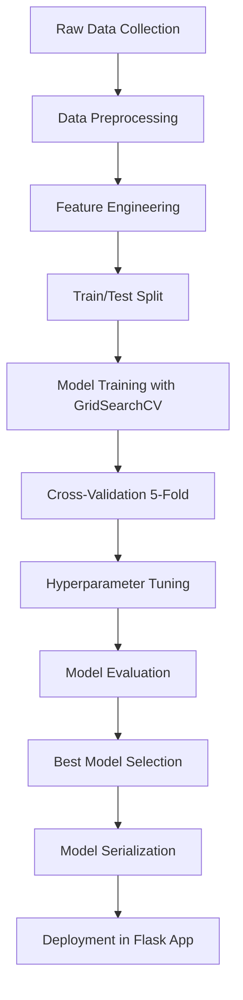

# Multi-Model Disease Prediction System Using Symptom Analysis and Machine Learning

---

**Authors:** Rushi Gokani et al.

**Date:** April 2026

**Keywords:** Disease Prediction, Machine Learning, Natural Language Processing, Support Vector Machine, Naive Bayes, TF-IDF, Symptom Analysis, Diabetes Prediction, SMOTE, Neural Network, Chatbot

---

## Abstract

Early and accurate disease prediction plays a critical role in improving patient outcomes and reducing the burden on healthcare systems. This paper presents a comprehensive multi-model disease prediction system that leverages machine learning techniques to predict diseases from patient-reported symptoms. The system implements four distinct prediction modules: (1) a binary symptom-based classifier using Support Vector Machines (SVM) achieving 100% test accuracy across 42 diseases and 132 symptoms, (2) a natural language text-based classifier using Multinomial Naive Bayes with TF-IDF vectorization achieving 97.92% accuracy across 24 diseases, (3) a diabetes prediction model trained on the PIMA Indians dataset, and (4) an advanced diabetes risk assessment model trained on the CDC BRFSS 2015 dataset comprising 253,680 health records with SMOTE-based class balancing. Additionally, a PyTorch-based neural network chatbot provides conversational health guidance. Extensive hyperparameter tuning and cross-validation were employed across all models. The system is deployed as a Flask-based web application providing an accessible interface for symptom-based disease screening.

---

## Table of Contents

1. [Introduction](#1-introduction)
2. [Literature Review](#2-literature-review)
3. [Datasets](#3-datasets)
4. [Methodology](#4-methodology)
5. [System Architecture](#5-system-architecture)
6. [Results and Evaluation](#6-results-and-evaluation)
7. [Discussion](#7-discussion)
8. [Disease Information Integration](#8-disease-information-integration)
9. [Implementation Details](#9-implementation-details)
10. [Conclusion](#10-conclusion)
11. [References](#11-references)

---

## 1. Introduction

### 1.1 Background

The healthcare industry faces persistent challenges in early disease detection and diagnosis. Patients often delay seeking medical attention due to uncertainty about the severity of their symptoms, limited access to specialists, or financial constraints. Machine learning (ML) offers a promising avenue for building intelligent decision-support systems that can assist both patients and healthcare providers in preliminary disease screening.

Disease prediction from symptoms is fundamentally a multi-class classification problem where the input features represent the presence or absence of specific symptoms and the output is a predicted disease label. The challenge lies in handling the high dimensionality of symptom spaces, the overlap of symptoms across diseases, and the varying granularity of patient-reported symptom descriptions.

### 1.2 Problem Statement

Existing disease prediction systems typically focus on a single prediction modality, either structured binary symptom inputs or free-text descriptions, but rarely both. Furthermore, specialized disease prediction (such as diabetes risk assessment) is often treated as a separate system entirely. This fragmentation limits usability and fails to leverage the complementary strengths of different prediction approaches.

### 1.3 Objectives

The objectives of this research are:

1. To develop and evaluate multiple ML classifiers for disease prediction using binary symptom vectors.
2. To implement a natural language processing (NLP) pipeline for disease prediction from free-text symptom descriptions.
3. To build specialized diabetes prediction models using both the PIMA Indians dataset and the large-scale CDC BRFSS 2015 dataset.
4. To design a chatbot using PyTorch neural networks for conversational health guidance.
5. To compare model performance across different algorithms and identify the best-performing models for each prediction task.
6. To integrate all models into a unified, accessible web-based application.

### 1.4 Scope

This paper focuses exclusively on the machine learning models, datasets, data preprocessing techniques, feature engineering, model training, and evaluation metrics. Database design, user management, and payment integration are outside the scope of this work.

---

## 2. Literature Review

### 2.1 Machine Learning in Healthcare

Machine learning has been extensively applied in healthcare for tasks including medical image analysis, electronic health record (EHR) mining, drug discovery, and clinical decision support. Supervised learning approaches, particularly classification algorithms, have shown strong performance in disease prediction tasks where labeled training data is available (Obermeyer & Emanuel, 2016).

### 2.2 Symptom-Based Disease Prediction

Prior work in symptom-based disease prediction has employed various algorithms including Decision Trees, Random Forests, Naive Bayes, and ensemble methods. Kunjir et al. (2017) demonstrated that Decision Tree classifiers could effectively predict diseases from binary symptom vectors. Sharma and Kumar (2020) explored ensemble methods and found that combining multiple classifiers improved prediction robustness.

### 2.3 NLP for Medical Text Classification

Natural Language Processing techniques, particularly TF-IDF (Term Frequency-Inverse Document Frequency) vectorization combined with traditional classifiers, have been applied to medical text classification. Simpler models like Multinomial Naive Bayes with well-tuned TF-IDF features often achieve competitive performance on moderately sized datasets with lower computational cost (Wang & Manning, 2012).

### 2.4 Diabetes Prediction

Diabetes prediction has been a well-studied problem, with the PIMA Indians Diabetes Dataset serving as a benchmark. Smith et al. (1988) originally introduced the dataset. The CDC's Behavioral Risk Factor Surveillance System (BRFSS) dataset provides a larger-scale, population-level alternative with richer feature sets including lifestyle and behavioral indicators.

---

## 3. Datasets

### 3.1 Dataset Overview

```
+================================================================+
|                    DATASETS SUMMARY                              |
+================================================================+
| Dataset               | Samples  | Features | Classes | Type    |
|-----------------------|----------|----------|---------|---------|
| Binary Symptom        | 4,920    | 132      | 42      | Binary  |
| Text Symptom          | 1,200    | Text     | 24      | NLP     |
| PIMA Diabetes         | 768      | 8        | 2       | Numeric |
| BRFSS 2015 Diabetes   | 253,680  | 20       | 2       | Mixed   |
| Chatbot Intents       | Variable | Text     | Multi   | Text    |
+================================================================+
```

---

### 3.2 Binary Symptom Dataset

| Property | Detail |
|---|---|
| **Training samples** | 4,920 |
| **Test samples** | 42 |
| **Features** | 132 binary symptom indicators |
| **Target classes** | 42 unique diseases |
| **Samples per disease** | ~120 (training set) |
| **Feature encoding** | Binary (0 = absent, 1 = present) |
| **Train/Val split** | 80/20 (stratified) from training set |

#### 3.2.1 Dataset Structure

```
+------------------------------------------------------------------+
|                 training_data.csv (4,920 rows)                     |
+------------------------------------------------------------------+
| itching | skin_rash | ... | fatigue | ... (132 cols) | prognosis  |
|---------|-----------|-----|---------|----------------|------------|
|    1    |     1     | ... |    0    |       ...      | Psoriasis  |
|    0    |     0     | ... |    1    |       ...      | Diabetes   |
|    1    |     0     | ... |    0    |       ...      | Allergy    |
|   ...   |    ...    | ... |   ...   |       ...      |    ...     |
+------------------------------------------------------------------+
```

#### 3.2.2 Symptom Categories (132 features)

```
+-----------------------------------------------------------------------+
|                        SYMPTOM FEATURE SPACE                            |
+-----------------------------------------------------------------------+
|                                                                        |
|  DERMATOLOGICAL (18 features)                                          |
|  +----------------------------------------------------------------+   |
|  | itching, skin_rash, nodal_skin_eruptions, pus_filled_pimples,  |   |
|  | blackheads, scurring, skin_peeling, blister, yellowish_skin,    |   |
|  | red_sore_around_nose, dischromic_patches, yellow_crust_ooze,    |   |
|  | silver_like_dusting, small_dents_in_nails, inflammatory_nails,  |   |
|  | bruising, toxic_look_(typhos), brittle_nails                    |   |
|  +----------------------------------------------------------------+   |
|                                                                        |
|  GASTROINTESTINAL (15 features)                                        |
|  +----------------------------------------------------------------+   |
|  | stomach_pain, acidity, vomiting, nausea, diarrhoea,             |   |
|  | constipation, abdominal_pain, passage_of_gases, belly_pain,     |   |
|  | indigestion, loss_of_appetite, excessive_hunger, bloody_stool,  |   |
|  | irritation_in_anus, pain_during_bowel_movements                 |   |
|  +----------------------------------------------------------------+   |
|                                                                        |
|  RESPIRATORY (12 features)                                             |
|  +----------------------------------------------------------------+   |
|  | continuous_sneezing, breathlessness, cough, phlegm,             |   |
|  | throat_irritation, runny_nose, congestion, chest_pain,          |   |
|  | mucoid_sputum, rusty_sputum, sinus_pressure, fast_heart_rate    |   |
|  +----------------------------------------------------------------+   |
|                                                                        |
|  MUSCULOSKELETAL (14 features)                                         |
|  +----------------------------------------------------------------+   |
|  | joint_pain, muscle_wasting, muscle_weakness, stiff_neck,        |   |
|  | swelling_joints, movement_stiffness, painful_walking,           |   |
|  | knee_pain, hip_joint_pain, neck_pain, back_pain, cramps,        |   |
|  | swelling_of_stomach, swollen_legs                               |   |
|  +----------------------------------------------------------------+   |
|                                                                        |
|  NEUROLOGICAL (12 features)                                            |
|  +----------------------------------------------------------------+   |
|  | headache, dizziness, loss_of_balance, lack_of_concentration,    |   |
|  | altered_sensorium, coma, spinning_movements, unsteadiness,      |   |
|  | visual_disturbances, blurred_and_distorted_vision, slurred_speech|  |
|  | weakness_of_one_body_side                                        |   |
|  +----------------------------------------------------------------+   |
|                                                                        |
|  SYSTEMIC/GENERAL (20+ features)                                       |
|  +----------------------------------------------------------------+   |
|  | fatigue, weight_loss, weight_gain, lethargy, malaise,           |   |
|  | high_fever, mild_fever, chills, sweating, dehydration,          |   |
|  | restlessness, mood_swings, irritability, anxiety,               |   |
|  | cold_hands_and_feets, swelled_lymph_nodes, enlarged_thyroid,    |   |
|  | puffy_face_and_eyes, abnormal_menstruation, ...                 |   |
|  +----------------------------------------------------------------+   |
|                                                                        |
|  HEPATIC/URINARY (15+ features)                                        |
|  +----------------------------------------------------------------+   |
|  | dark_urine, yellow_urine, yellowing_of_eyes, fluid_overload,   |   |
|  | swelling_of_stomach, distention_of_abdomen, liver_pain,         |   |
|  | acute_liver_failure, burning_micturition, bladder_discomfort,   |   |
|  | foul_smell_of_urine, continuous_feel_of_urine, ...              |   |
|  +----------------------------------------------------------------+   |
|                                                                        |
+-----------------------------------------------------------------------+
```

#### 3.2.3 Disease Classes (42 diseases)

```
+------------------------------------------------------------------------+
|                         42 DISEASE CLASSES                               |
+------------------------------------------------------------------------+
|                                                                         |
| INFECTIONS          | LIVER DISEASES      | METABOLIC/ENDOCRINE        |
| +-----------------+ | +-----------------+ | +------------------------+ |
| | Fungal Infection| | | Hepatitis A     | | | Diabetes               | |
| | Malaria         | | | Hepatitis B     | | | Hypothyroidism         | |
| | Chicken Pox     | | | Hepatitis C     | | | Hyperthyroidism        | |
| | Dengue          | | | Hepatitis D     | | | Hypoglycemia           | |
| | Typhoid         | | | Hepatitis E     | | +------------------------+ |
| | Tuberculosis    | | | Alcoholic Hep.  | |                            |
| | Common Cold     | | | Jaundice        | | CARDIOVASCULAR             |
| | Pneumonia       | | | Chronic Cholest.| | +------------------------+ |
| | AIDS            | | +-----------------+ | | Hypertension           | |
| | Impetigo        | |                     | | Heart Attack           | |
| +-----------------+ | MUSCULOSKELETAL     | | Varicose Veins         | |
|                     | +-----------------+ | +------------------------+ |
| GASTROINTESTINAL    | | Osteoarthritis  | |                            |
| +-----------------+ | | Arthritis       | | NEUROLOGICAL               |
| | GERD            | | | Cervical Spond. | | +------------------------+ |
| | Peptic Ulcer    | | +-----------------+ | | Migraine               | |
| | Gastroenteritis | |                     | | Paralysis (Brain Hem.) | |
| +-----------------+ | SKIN/DERMA          | | Vertigo (BPPV)         | |
|                     | +-----------------+ | +------------------------+ |
| OTHER               | | Acne            | |                            |
| +-----------------+ | | Psoriasis       | | RESPIRATORY                |
| | Allergy         | | | Drug Reaction   | | +------------------------+ |
| | Drug Reaction   | | +-----------------+ | | Bronchial Asthma       | |
| | Dimorphic Piles | |                     | +------------------------+ |
| | UTI             | |                     |                            |
| +-----------------+ |                     |                            |
+------------------------------------------------------------------------+
```

---

### 3.3 Text-Based Symptom Dataset (Symptom2Disease)

| Property | Detail |
|---|---|
| **Total samples** | 1,200 |
| **Features** | Free-text symptom descriptions |
| **Target classes** | 24 unique diseases |
| **Samples per disease** | 50 |
| **Train/Test split** | 80/20 (stratified) |
| **Training samples** | 960 |
| **Test samples** | 240 |

#### 3.3.1 Dataset Format

```
+------------------------------------------------------------------+
|              Symptom2Disease.csv Structure                         |
+------------------------------------------------------------------+
| label                | text                                       |
|----------------------|--------------------------------------------|
| Psoriasis            | "I have been experiencing itchy, dry,      |
|                      |  scaly patches on my skin..."              |
| Migraine             | "I've been having severe headaches with    |
|                      |  sensitivity to light and nausea..."       |
| Arthritis            | "My joints are stiff and painful,          |
|                      |  especially in the morning..."             |
| Bronchial Asthma     | "I have difficulty breathing and my        |
|                      |  chest feels tight, especially at night.." |
+------------------------------------------------------------------+
```

#### 3.3.2 Disease Distribution (24 classes x 50 samples each)

```
Disease Class Distribution (Text Dataset - 1,200 samples total)
================================================================

Psoriasis            |████████████████████| 50
Acne                 |████████████████████| 50
Arthritis            |████████████████████| 50
Bronchial Asthma     |████████████████████| 50
Cervical spondylosis |████████████████████| 50
Chicken pox          |████████████████████| 50
Common Cold          |████████████████████| 50
Dengue               |████████████████████| 50
Diabetes             |████████████████████| 50
Dimorphic Hemorrhoids|████████████████████| 50
Drug reaction        |████████████████████| 50
Fungal infection     |████████████████████| 50
GERD                 |████████████████████| 50
Hypertension         |████████████████████| 50
Impetigo             |████████████████████| 50
Jaundice             |████████████████████| 50
Malaria              |████████████████████| 50
Migraine             |████████████████████| 50
Peptic ulcer disease |████████████████████| 50
Pneumonia            |████████████████████| 50
Typhoid              |████████████████████| 50
UTI                  |████████████████████| 50
Varicose Veins       |████████████████████| 50
Allergy              |████████████████████| 50
                     |----|----|----|----|
                     0   12   25   37   50
                         Samples per class
```

---

### 3.4 PIMA Indians Diabetes Dataset

| Property | Detail |
|---|---|
| **Total samples** | 768 |
| **Features** | 8 numeric health indicators |
| **Target** | Binary (0 = Non-Diabetic, 1 = Diabetic) |
| **Source** | National Institute of Diabetes and Digestive and Kidney Diseases |
| **Train/Test split** | 80/20 |

#### 3.4.1 Feature Description

```
+--------------------------------------------------------------------+
|              PIMA DIABETES DATASET FEATURES                          |
+--------------------------------------------------------------------+
| #  | Feature                   | Type       | Range       | Unit   |
|----|---------------------------|------------|-------------|--------|
| 1  | Pregnancies               | Integer    | 0 - 17      | count  |
| 2  | Glucose                   | Continuous | 0 - 199     | mg/dL  |
| 3  | BloodPressure             | Continuous | 0 - 122     | mm Hg  |
| 4  | SkinThickness             | Continuous | 0 - 99      | mm     |
| 5  | Insulin                   | Continuous | 0 - 846     | mu U/ml|
| 6  | BMI                       | Continuous | 0 - 67.1    | kg/m^2 |
| 7  | DiabetesPedigreeFunction  | Continuous | 0.08 - 2.42 | score  |
| 8  | Age                       | Integer    | 21 - 81     | years  |
+--------------------------------------------------------------------+
| Target: Outcome (0 = Non-Diabetic, 1 = Diabetic)                    |
+--------------------------------------------------------------------+
```

#### 3.4.2 Class Distribution

```
PIMA Diabetes - Class Distribution (768 samples)
=================================================

Non-Diabetic (0):  |████████████████████████████████████| 500 (65.1%)
Diabetic (1):      |████████████████████████            | 268 (34.9%)
                   |----|----|----|----|----|----|----|----|
                   0   62  125  187  250  312  375  437  500
                                  Sample Count

Note: Dataset is IMBALANCED (65:35 ratio)
```

#### 3.4.3 Missing Values (Zeros = Missing)

```
Missing Value Analysis (biologically implausible zeros)
========================================================

Glucose:        |████                                    |  5 values
BloodPressure:  |█████████████                          | 35 values
SkinThickness:  |██████████████████████████████████████ |227 values
Insulin:        |███████████████████████████████████████|374 values
BMI:            |████                                    | 11 values
                |----|----|----|----|----|----|----|----|
                0   47   94  141  188  235  282  329  374

Treatment: Replace zeros with column-wise MEAN values
```

---

### 3.5 CDC BRFSS 2015 Diabetes Dataset

| Property | Detail |
|---|---|
| **Total samples** | 253,680 |
| **Features** | 20 health/behavioral indicators |
| **Target** | Binary (diabetes positive / negative) |
| **Source** | CDC Behavioral Risk Factor Surveillance System |
| **Class imbalance** | Significant (majority non-diabetic) |
| **After deduplication** | ~220,000+ unique records |

#### 3.5.1 Feature Categories

```
+====================================================================+
|               BRFSS 2015 FEATURES (20 indicators)                   |
+====================================================================+
|                                                                     |
|  CLINICAL INDICATORS                                                |
|  +---------------------------------------------------------------+ |
|  | HighBP          - High blood pressure (0/1)                    | |
|  | HighChol        - High cholesterol (0/1)                       | |
|  | CholCheck       - Cholesterol check in past 5 years (0/1)     | |
|  | BMI             - Body Mass Index (continuous)                 | |
|  | Stroke          - History of stroke (0/1)                      | |
|  | HeartDiseaseorAttack - CHD or MI history (0/1)                 | |
|  +---------------------------------------------------------------+ |
|                                                                     |
|  LIFESTYLE FACTORS                                                  |
|  +---------------------------------------------------------------+ |
|  | Smoker          - Smoked 100+ cigarettes in lifetime (0/1)    | |
|  | PhysActivity    - Physical activity past 30 days (0/1)        | |
|  | Fruits          - Consumes fruit 1+ times/day (0/1)           | |
|  | Veggies         - Consumes vegetables 1+ times/day (0/1)      | |
|  | HvyAlcoholConsump - Heavy alcohol consumption (0/1)           | |
|  +---------------------------------------------------------------+ |
|                                                                     |
|  HEALTHCARE ACCESS                                                  |
|  +---------------------------------------------------------------+ |
|  | AnyHealthcare   - Has healthcare coverage (0/1)               | |
|  | NoDocbcCost     - Could not see doctor due to cost (0/1)      | |
|  +---------------------------------------------------------------+ |
|                                                                     |
|  HEALTH STATUS                                                      |
|  +---------------------------------------------------------------+ |
|  | GenHlth         - General health rating (1-5 scale)           | |
|  | MentHlth        - Days poor mental health (0-30)              | |
|  | PhysHlth        - Days physical illness (0-30)                | |
|  | DiffWalk        - Difficulty walking/climbing stairs (0/1)    | |
|  +---------------------------------------------------------------+ |
|                                                                     |
|  DEMOGRAPHICS                                                       |
|  +---------------------------------------------------------------+ |
|  | Sex             - Biological sex (0/1)                        | |
|  | Age             - Age category (1-13)                         | |
|  +---------------------------------------------------------------+ |
|                                                                     |
+====================================================================+
```

#### 3.5.2 Class Imbalance Problem

```
BRFSS 2015 - Class Distribution BEFORE SMOTE
==============================================

No Diabetes (0): |████████████████████████████████████████| ~218,000 (86%)
Diabetes (1):    |██████                                  |  ~35,000 (14%)
                 |---------|---------|---------|----------|
                 0       55K      110K      165K      220K

BRFSS 2015 - Class Distribution AFTER SMOTE (Training Set Only)
================================================================

No Diabetes (0): |████████████████████████████████████████| ~174,000 (50%)
Diabetes (1):    |████████████████████████████████████████| ~174,000 (50%)
                 |---------|---------|---------|----------|
                 0       44K       87K      131K      174K

SMOTE generates synthetic minority samples to achieve balanced classes.
```

---

## 4. Methodology

### 4.1 Overall Methodology Flow



### 4.2 Data Preprocessing Pipelines

#### 4.2.1 Binary Symptom Data Pipeline

```
┌─────────────────────────────────────────────────────────────────┐
│              BINARY SYMPTOM PREPROCESSING PIPELINE                │
├─────────────────────────────────────────────────────────────────┤
│                                                                  │
│  Step 1: Load CSV Data                                           │
│  ┌─────────────┐                                                 │
│  │ training_   │──> pandas.read_csv()                            │
│  │ data.csv    │    (4,920 rows x 133 cols)                      │
│  └─────────────┘                                                 │
│         │                                                        │
│         v                                                        │
│  Step 2: Feature/Target Separation                               │
│  ┌─────────────────────────────────────────────┐                 │
│  │ X = df[132 symptom columns]   (binary 0/1)  │                 │
│  │ y = df['prognosis']           (disease name) │                 │
│  └─────────────────────────────────────────────┘                 │
│         │                                                        │
│         v                                                        │
│  Step 3: Label Encoding                                          │
│  ┌─────────────────────────────────────────────┐                 │
│  │ LabelEncoder: disease_name -> integer (0-41) │                 │
│  │ Example: "Diabetes" -> 7, "Malaria" -> 25    │                 │
│  └─────────────────────────────────────────────┘                 │
│         │                                                        │
│         v                                                        │
│  Step 4: Stratified Train/Validation Split                       │
│  ┌─────────────────────────────────────────────┐                 │
│  │ train_test_split(test_size=0.2, stratify=y)  │                 │
│  │ Training: 3,936 samples                      │                 │
│  │ Validation: 984 samples                      │                 │
│  └─────────────────────────────────────────────┘                 │
│         │                                                        │
│         v                                                        │
│  Step 5: Ready for Model Training                                │
│  ┌─────────────────────────────────────────────┐                 │
│  │ No scaling needed (features already binary)  │                 │
│  │ Input shape: (n_samples, 132)                │                 │
│  └─────────────────────────────────────────────┘                 │
│                                                                  │
└─────────────────────────────────────────────────────────────────┘
```

#### 4.2.2 Text-Based Symptom Data Pipeline

```
┌─────────────────────────────────────────────────────────────────┐
│             TEXT SYMPTOM PREPROCESSING PIPELINE                   │
├─────────────────────────────────────────────────────────────────┤
│                                                                  │
│  Step 1: Load & Clean Text Data                                  │
│  ┌─────────────────────────────────────────────┐                 │
│  │ df = read_csv('Symptom2Disease.csv')         │                 │
│  │ df = df[['label', 'text']].dropna()          │                 │
│  │ df['text'] = df['text'].str.strip()          │                 │
│  └─────────────────────────────────────────────┘                 │
│         │                                                        │
│         v                                                        │
│  Step 2: Label Encoding                                          │
│  ┌─────────────────────────────────────────────┐                 │
│  │ LabelEncoder: disease_label -> integer (0-23)│                 │
│  └─────────────────────────────────────────────┘                 │
│         │                                                        │
│         v                                                        │
│  Step 3: Stratified Train/Test Split (80/20)                     │
│  ┌─────────────────────────────────────────────┐                 │
│  │ Training: 960 text samples                   │                 │
│  │ Test: 240 text samples                       │                 │
│  └─────────────────────────────────────────────┘                 │
│         │                                                        │
│         v                                                        │
│  Step 4: TF-IDF Vectorization (inside Pipeline)                  │
│  ┌─────────────────────────────────────────────┐                 │
│  │ TfidfVectorizer(                             │                 │
│  │   stop_words='english',                      │                 │
│  │   sublinear_tf=True,                         │                 │
│  │   max_features=3000-8000,    <- tuned        │                 │
│  │   ngram_range=(1,1)/(1,2)/(1,3)  <- tuned   │                 │
│  │ )                                            │                 │
│  └─────────────────────────────────────────────┘                 │
│         │                                                        │
│         v                                                        │
│  Step 5: Sparse Matrix Output                                    │
│  ┌─────────────────────────────────────────────┐                 │
│  │ Output: (n_samples, max_features) sparse     │                 │
│  │ Each cell = TF-IDF weight of term in doc     │                 │
│  └─────────────────────────────────────────────┘                 │
│                                                                  │
└─────────────────────────────────────────────────────────────────┘
```

**TF-IDF Formula:**

```
TF-IDF(t, d) = TF(t, d) x log(N / DF(t))

Where:
  TF(t, d) = (1 + log(freq(t,d)))    [sublinear_tf=True]
  N         = Total number of documents
  DF(t)     = Number of documents containing term t

Example:
  Text: "I have joint pain and stiffness in my hands"
  After stop word removal: ["joint", "pain", "stiffness", "hands"]
  Bigrams (ngram=1,2): ["joint", "pain", "stiffness", "hands",
                         "joint pain", "pain stiffness", "stiffness hands"]
  -> TF-IDF vector of shape (1, 8000) with non-zero entries for matching terms
```

#### 4.2.3 PIMA Diabetes Data Pipeline

```
┌─────────────────────────────────────────────────────────────────┐
│             PIMA DIABETES PREPROCESSING PIPELINE                  │
├─────────────────────────────────────────────────────────────────┤
│                                                                  │
│  Step 1: Load Data                                               │
│  ┌───────────────────────────────────┐                           │
│  │ df = read_csv('diabetes.csv')     │                           │
│  │ Shape: (768, 9)                   │                           │
│  └───────────────────────────────────┘                           │
│         │                                                        │
│         v                                                        │
│  Step 2: Drop Duplicates                                         │
│  ┌───────────────────────────────────┐                           │
│  │ df = df.drop_duplicates()         │                           │
│  └───────────────────────────────────┘                           │
│         │                                                        │
│         v                                                        │
│  Step 3: Handle Missing Values (zeros)                           │
│  ┌───────────────────────────────────────────────────────┐       │
│  │ For columns: Glucose, BloodPressure, SkinThickness,   │       │
│  │              Insulin, BMI                              │       │
│  │                                                       │       │
│  │ df[col] = df[col].replace(0, df[col].mean())         │       │
│  │                                                       │       │
│  │ Before:  [148, 0, 33.6, 0, 50]                       │       │
│  │ After:   [148, 72.4, 33.6, 79.8, 50]                 │       │
│  └───────────────────────────────────────────────────────┘       │
│         │                                                        │
│         v                                                        │
│  Step 4: Feature Scaling (StandardScaler)                        │
│  ┌───────────────────────────────────────────────────────┐       │
│  │ X_scaled = (X - mean) / std                           │       │
│  │                                                       │       │
│  │ Before: [148.0, 72.4, 33.6, 79.8, 50.0, 33.6, ...]  │       │
│  │ After:  [0.84, -0.03, 0.15, -0.69, 0.20, 0.47, ...] │       │
│  └───────────────────────────────────────────────────────┘       │
│         │                                                        │
│         v                                                        │
│  Step 5: Train/Test Split (80/20)                                │
│  ┌───────────────────────────────────┐                           │
│  │ Training: ~614 samples            │                           │
│  │ Test: ~154 samples                │                           │
│  └───────────────────────────────────┘                           │
│                                                                  │
└─────────────────────────────────────────────────────────────────┘
```

#### 4.2.4 BRFSS Diabetes Data Pipeline

```
┌─────────────────────────────────────────────────────────────────┐
│             BRFSS DIABETES PREPROCESSING PIPELINE                 │
├─────────────────────────────────────────────────────────────────┤
│                                                                  │
│  Step 1: Load Data                                               │
│  ┌───────────────────────────────────────────┐                   │
│  │ Shape: (253,680 rows x 21 cols)           │                   │
│  └───────────────────────────────────────────┘                   │
│         │                                                        │
│         v                                                        │
│  Step 2: Drop Duplicates                                         │
│  ┌───────────────────────────────────────────┐                   │
│  │ Remove duplicate rows                     │                   │
│  └───────────────────────────────────────────┘                   │
│         │                                                        │
│         v                                                        │
│  Step 3: Stratified Train/Test Split (80/20)                     │
│  ┌───────────────────────────────────────────┐                   │
│  │ Preserves original class distribution     │                   │
│  │ Training: ~174,000+ | Test: ~44,000+      │                   │
│  └───────────────────────────────────────────┘                   │
│         │                                                        │
│         v                                                        │
│  Step 4: SMOTE Oversampling (TRAINING SET ONLY)                  │
│  ┌───────────────────────────────────────────┐                   │
│  │ SMOTE(random_state=42)                    │                   │
│  │                                           │                   │
│  │ Algorithm:                                │                   │
│  │ 1. Select minority sample x_i            │                   │
│  │ 2. Find k nearest neighbors              │                   │
│  │ 3. Generate synthetic: x_new =           │                   │
│  │    x_i + rand(0,1) * (x_nn - x_i)       │                   │
│  │                                           │                   │
│  │ Result: Balanced 50/50 classes            │                   │
│  └───────────────────────────────────────────┘                   │
│         │                                                        │
│         v                                                        │
│  Step 5: StandardScaler                                          │
│  ┌───────────────────────────────────────────┐                   │
│  │ Fit on training, transform both sets      │                   │
│  └───────────────────────────────────────────┘                   │
│                                                                  │
└─────────────────────────────────────────────────────────────────┘
```

---

### 4.3 Model Training Strategy

#### 4.3.1 GridSearchCV with Stratified K-Fold

```
┌──────────────────────────────────────────────────────────────────┐
│           HYPERPARAMETER TUNING STRATEGY                          │
├──────────────────────────────────────────────────────────────────┤
│                                                                   │
│  GridSearchCV(                                                    │
│      estimator = model,                                           │
│      param_grid = hyperparameter_space,                           │
│      cv = StratifiedKFold(n_splits=5, shuffle=True),              │
│      scoring = 'accuracy',                                        │
│      n_jobs = -1  (parallel processing)                           │
│  )                                                                │
│                                                                   │
│  ┌────────────────────────────────────────────────────────┐       │
│  │  5-Fold Stratified Cross-Validation                    │       │
│  │                                                        │       │
│  │  Fold 1: [████ TRAIN ████][TEST][ TRAIN ][ TRAIN ]     │       │
│  │  Fold 2: [TEST][████ TRAIN ████][ TRAIN ][ TRAIN ]     │       │
│  │  Fold 3: [ TRAIN ][TEST][████ TRAIN ████][ TRAIN ]     │       │
│  │  Fold 4: [ TRAIN ][ TRAIN ][TEST][████ TRAIN ████]     │       │
│  │  Fold 5: [ TRAIN ][ TRAIN ][ TRAIN ][TEST][█TRAIN█]   │       │
│  │                                                        │       │
│  │  Final Score = Mean(Fold1, Fold2, ..., Fold5)          │       │
│  │  Each fold preserves class distribution (stratified)   │       │
│  └────────────────────────────────────────────────────────┘       │
│                                                                   │
└──────────────────────────────────────────────────────────────────┘
```

#### 4.3.2 Binary Models - Hyperparameter Search Spaces

```
+====================================================================+
|            BINARY MODELS - HYPERPARAMETER GRID                       |
+====================================================================+
|                                                                     |
| MODEL: SVM (Support Vector Machine)                                 |
| ┌─────────────────────────────────────────────────────────────────┐ |
| │ C:      [0.1, 1, 10, 100]          (regularization strength)   │ |
| │ kernel: [rbf, linear]              (decision boundary type)    │ |
| │ gamma:  [scale, auto]              (kernel coefficient)        │ |
| │ Total combinations: 4 x 2 x 2 = 16                            │ |
| │ BEST: C=0.1, kernel=rbf, gamma=scale                          │ |
| └─────────────────────────────────────────────────────────────────┘ |
|                                                                     |
| MODEL: Logistic Regression                                          |
| ┌─────────────────────────────────────────────────────────────────┐ |
| │ C:      [0.1, 1, 10, 100]          (inverse regularization)    │ |
| │ solver: [lbfgs, liblinear]         (optimization algorithm)    │ |
| │ max_iter: 2000                     (convergence iterations)    │ |
| │ Total combinations: 4 x 2 = 8                                 │ |
| │ BEST: C=0.1, solver=lbfgs                                     │ |
| └─────────────────────────────────────────────────────────────────┘ |
|                                                                     |
| MODEL: Decision Tree                                                |
| ┌─────────────────────────────────────────────────────────────────┐ |
| │ criterion:        [gini, entropy]                              │ |
| │ max_depth:        [10, 20, 30, None]                           │ |
| │ min_samples_split:[2, 5, 10]                                   │ |
| │ min_samples_leaf: [1, 2, 4]                                    │ |
| │ Total combinations: 2 x 4 x 3 x 3 = 72                       │ |
| │ BEST: criterion=gini, max_depth=None, split=2, leaf=1         │ |
| └─────────────────────────────────────────────────────────────────┘ |
|                                                                     |
| MODEL: Random Forest                                                |
| ┌─────────────────────────────────────────────────────────────────┐ |
| │ n_estimators:     [100, 200, 300]   (number of trees)          │ |
| │ max_depth:        [10, 20, 30, None]                           │ |
| │ min_samples_split:[2, 5]                                       │ |
| │ min_samples_leaf: [1, 2]                                       │ |
| │ Total combinations: 3 x 4 x 2 x 2 = 48                       │ |
| │ BEST: n_estimators=100, max_depth=10, split=2, leaf=1         │ |
| └─────────────────────────────────────────────────────────────────┘ |
|                                                                     |
| MODEL: Gradient Boosting                                            |
| ┌─────────────────────────────────────────────────────────────────┐ |
| │ n_estimators:  [100, 200, 300]      (boosting rounds)          │ |
| │ learning_rate: [0.05, 0.1, 0.2]    (step size)                │ |
| │ max_depth:     [3, 5, 7]            (tree depth)              │ |
| │ Total combinations: 3 x 3 x 3 = 27                            │ |
| │ BEST: n_estimators=100, learning_rate=0.05, max_depth=5       │ |
| └─────────────────────────────────────────────────────────────────┘ |
|                                                                     |
| MODEL: XGBoost                                                      |
| ┌─────────────────────────────────────────────────────────────────┐ |
| │ n_estimators:  [100, 200, 300]      (boosting rounds)          │ |
| │ learning_rate: [0.05, 0.1, 0.2]    (step size)                │ |
| │ max_depth:     [3, 5, 7]            (tree depth)              │ |
| │ subsample:     [0.8, 1.0]           (row sampling ratio)      │ |
| │ Total combinations: 3 x 3 x 3 x 2 = 54                       │ |
| │ BEST: n_estimators=200, lr=0.05, max_depth=3, subsample=0.8  │ |
| └─────────────────────────────────────────────────────────────────┘ |
|                                                                     |
+====================================================================+
```

#### 4.3.3 Text Models - Pipeline + Hyperparameter Search

```
+====================================================================+
|         TEXT MODELS - PIPELINE ARCHITECTURE + GRID                   |
+====================================================================+
|                                                                     |
|  Pipeline Structure:                                                |
|  ┌──────────────────┐     ┌──────────────────┐                     |
|  │  TF-IDF Stage    │ --> │ Classifier Stage  │                     |
|  │  (vectorizer)    │     │ (model)           │                     |
|  └──────────────────┘     └──────────────────┘                     |
|                                                                     |
| MODEL: Multinomial Naive Bayes                                      |
| ┌─────────────────────────────────────────────────────────────────┐ |
| │ tfidf__max_features: [3000, 5000, 8000]                        │ |
| │ tfidf__ngram_range:  [(1,1), (1,2), (1,3)]                     │ |
| │ clf__alpha:          [0.01, 0.1, 0.5, 1.0] (smoothing)        │ |
| │ Total combinations: 3 x 3 x 4 = 36                            │ |
| │ BEST: max_features=8000, ngram=(1,2), alpha=0.01              │ |
| └─────────────────────────────────────────────────────────────────┘ |
|                                                                     |
| MODEL: Linear SVC                                                   |
| ┌─────────────────────────────────────────────────────────────────┐ |
| │ tfidf__max_features: [3000, 5000, 8000]                        │ |
| │ tfidf__ngram_range:  [(1,1), (1,2), (1,3)]                     │ |
| │ clf__C:              [0.1, 1, 10]                              │ |
| │ Total combinations: 3 x 3 x 3 = 27                            │ |
| │ BEST: max_features=3000, ngram=(1,1), C=10                    │ |
| └─────────────────────────────────────────────────────────────────┘ |
|                                                                     |
| MODEL: Logistic Regression (Text)                                   |
| ┌─────────────────────────────────────────────────────────────────┐ |
| │ tfidf__max_features: [3000, 5000, 8000]                        │ |
| │ tfidf__ngram_range:  [(1,1), (1,2)]                            │ |
| │ clf__C:              [0.1, 1, 10, 100]                         │ |
| │ clf__solver:         [lbfgs, liblinear]                        │ |
| │ Total combinations: 3 x 2 x 4 x 2 = 48                       │ |
| │ BEST: max_features=3000, ngram=(1,1), C=10, solver=liblinear  │ |
| └─────────────────────────────────────────────────────────────────┘ |
|                                                                     |
| MODEL: Random Forest (Text)                                         |
| ┌─────────────────────────────────────────────────────────────────┐ |
| │ tfidf__max_features: [3000, 5000]                              │ |
| │ tfidf__ngram_range:  [(1,1), (1,2)]                            │ |
| │ clf__n_estimators:   [100, 200, 300]                           │ |
| │ clf__max_depth:      [10, 20, None]                            │ |
| │ Total combinations: 2 x 2 x 3 x 3 = 36                       │ |
| │ BEST: max_features=3000, ngram=(1,2), n_est=300, depth=None   │ |
| └─────────────────────────────────────────────────────────────────┘ |
|                                                                     |
| MODEL: XGBoost (Text)                                               |
| ┌─────────────────────────────────────────────────────────────────┐ |
| │ tfidf__max_features: [3000, 5000]                              │ |
| │ tfidf__ngram_range:  [(1,1), (1,2)]                            │ |
| │ clf__n_estimators:   [100, 200, 300]                           │ |
| │ clf__learning_rate:  [0.05, 0.1, 0.2]                         │ |
| │ clf__max_depth:      [3, 5, 7]                                 │ |
| │ Total combinations: 2 x 2 x 3 x 3 x 3 = 108                  │ |
| │ BEST: max_features=3000, ngram=(1,1), lr=0.05, depth=7, n=100 │ |
| └─────────────────────────────────────────────────────────────────┘ |
|                                                                     |
+====================================================================+
```

#### 4.3.4 BRFSS Diabetes Models

```
+====================================================================+
|          BRFSS DIABETES - MODELS TRAINED                             |
+====================================================================+
|                                                                     |
| Models evaluated (all with SMOTE + StandardScaler):                 |
|                                                                     |
| 1. Logistic Regression (max_iter=1000, solver='liblinear')          |
| 2. K-Nearest Neighbors (default k=5)                               |
| 3. Gaussian Naive Bayes                                             |
| 4. Decision Tree (random_state=42)                                  |
| 5. Random Forest (n_estimators=100, n_jobs=-1)       <-- BEST       |
| 6. Gradient Boosting (n_estimators=100)                             |
|                                                                     |
+====================================================================+
```

---

## 5. System Architecture

### 5.1 High-Level System Architecture

```
┌══════════════════════════════════════════════════════════════════════┐
║                    DISEASE PREDICTION SYSTEM                         ║
║                    HIGH-LEVEL ARCHITECTURE                           ║
├══════════════════════════════════════════════════════════════════════┤
║                                                                     ║
║  ┌───────────────────────────────────────────────────────────┐      ║
║  │                    USER INTERFACE LAYER                    │      ║
║  │  ┌──────────┐ ┌──────────┐ ┌──────────┐ ┌──────────┐    │      ║
║  │  │ Symptom  │ │ Text     │ │ Diabetes │ │ Chatbot  │    │      ║
║  │  │ Checkbox │ │ Input    │ │ Forms    │ │ Interface│    │      ║
║  │  │ Form     │ │ Box      │ │ (2 types)│ │          │    │      ║
║  │  └────┬─────┘ └────┬─────┘ └────┬─────┘ └────┬─────┘    │      ║
║  └───────│─────────────│────────────│────────────│──────────┘      ║
║          │             │            │            │                   ║
║          v             v            v            v                   ║
║  ┌───────────────────────────────────────────────────────────┐      ║
║  │                    FLASK APPLICATION (app.py)              │      ║
║  │                                                           │      ║
║  │  /checkdisease    /predict_text   /diabeties   /predict1  │      ║
║  │  /diabetes_advanced                                       │      ║
║  └───────────────────────────────────────────────────────────┘      ║
║          │             │            │            │                   ║
║          v             v            v            v                   ║
║  ┌───────────────────────────────────────────────────────────┐      ║
║  │                  ML MODEL LAYER                            │      ║
║  │                                                           │      ║
║  │  ┌──────────┐ ┌──────────┐ ┌──────────┐ ┌──────────┐    │      ║
║  │  │ SVM      │ │ MNB +    │ │ SVM      │ │ PyTorch  │    │      ║
║  │  │ (Binary) │ │ TF-IDF   │ │ (PIMA)   │ │ NeuralNet│    │      ║
║  │  │          │ │ (Text)   │ │ + RF     │ │ (Chat)   │    │      ║
║  │  │ 100%     │ │ 97.92%   │ │ (BRFSS)  │ │          │    │      ║
║  │  └──────────┘ └──────────┘ └──────────┘ └──────────┘    │      ║
║  └───────────────────────────────────────────────────────────┘      ║
║          │             │            │            │                   ║
║          v             v            v            v                   ║
║  ┌───────────────────────────────────────────────────────────┐      ║
║  │               KNOWLEDGE BASE LAYER                        │      ║
║  │                                                           │      ║
║  │  ┌──────────────────────────────────────────────────┐     │      ║
║  │  │ disease_info.json                                │     │      ║
║  │  │ - Description, Symptoms, Precautions             │     │      ║
║  │  │ - Medications, Diet, When to see doctor          │     │      ║
║  │  └──────────────────────────────────────────────────┘     │      ║
║  └───────────────────────────────────────────────────────────┘      ║
║                                                                     ║
╚══════════════════════════════════════════════════════════════════════╝
```

### 5.2 Model Architecture Details

#### 5.2.1 SVM (Binary Model) - Decision Boundary

```
┌──────────────────────────────────────────────────────────────────┐
│          SVM WITH RBF KERNEL - CONCEPTUAL ARCHITECTURE            │
├──────────────────────────────────────────────────────────────────┤
│                                                                   │
│  Input: x = [x1, x2, ..., x132]  (binary symptom vector)        │
│                                                                   │
│  Kernel Function (RBF):                                           │
│  K(xi, xj) = exp(-gamma * ||xi - xj||^2)                        │
│                                                                   │
│  Decision Function:                                               │
│  f(x) = sign( Σ αi * yi * K(xi, x) + b )                        │
│                                                                   │
│  Parameters:                                                      │
│  - C = 0.1 (soft margin, allows some misclassification)          │
│  - gamma = 'scale' = 1 / (n_features * X.var())                  │
│  - One-vs-One strategy for multi-class (42 classes)              │
│  - Total binary classifiers: 42*(42-1)/2 = 861                   │
│                                                                   │
│  ┌────────────────────────────────────────────────────┐           │
│  │  132-dim                    RBF Kernel              │           │
│  │  Input Space    ──────>    Feature Space            │           │
│  │                            (infinite dim)           │           │
│  │   ○  △  ○                      ○    ○              │           │
│  │  △  ○ △  ○     K(x,x')       ────────             │           │
│  │   ○ △  ○  △    ======>    △  △       ○  ○         │           │
│  │  △ ○  △  ○               ────────                  │           │
│  │   (overlapping)          △    △                    │           │
│  │                          (linearly separable)      │           │
│  └────────────────────────────────────────────────────┘           │
│                                                                   │
└──────────────────────────────────────────────────────────────────┘
```

#### 5.2.2 Multinomial Naive Bayes (Text Model)

```
┌──────────────────────────────────────────────────────────────────┐
│       MULTINOMIAL NAIVE BAYES - TEXT CLASSIFICATION                │
├──────────────────────────────────────────────────────────────────┤
│                                                                   │
│  Bayes' Theorem:                                                  │
│  P(disease | symptoms) = P(symptoms | disease) * P(disease)      │
│                          ─────────────────────────────────────    │
│                                  P(symptoms)                      │
│                                                                   │
│  Naive Independence Assumption:                                   │
│  P(w1, w2, ..., wn | class) = P(w1|class) * P(w2|class) * ...  │
│                                                                   │
│  With Laplace Smoothing (alpha = 0.01):                          │
│  P(wi | class) = (count(wi, class) + alpha)                      │
│                  ─────────────────────────────                    │
│                  (total_words_in_class + alpha * vocab_size)      │
│                                                                   │
│  Pipeline Flow:                                                   │
│  ┌─────────┐    ┌─────────────┐    ┌──────────────┐             │
│  │ Raw     │    │ TF-IDF      │    │ Multinomial  │             │
│  │ Text    │───>│ Vectorizer  │───>│ Naive Bayes  │──> Class    │
│  │         │    │ (8000 feat) │    │ (alpha=0.01) │             │
│  └─────────┘    └─────────────┘    └──────────────┘             │
│                                                                   │
│  Configuration:                                                   │
│  - max_features = 8000 (vocabulary size)                         │
│  - ngram_range = (1, 2) (unigrams + bigrams)                    │
│  - sublinear_tf = True (logarithmic TF)                          │
│  - stop_words = 'english'                                        │
│  - alpha = 0.01 (minimal smoothing)                              │
│                                                                   │
└──────────────────────────────────────────────────────────────────┘
```

#### 5.2.3 Neural Network Chatbot Architecture

```
┌──────────────────────────────────────────────────────────────────┐
│          PYTORCH NEURAL NETWORK - CHATBOT MODEL                   │
├──────────────────────────────────────────────────────────────────┤
│                                                                   │
│  class NeuralNet(nn.Module):                                      │
│                                                                   │
│  ┌─────────────────────────────────────────────────────────┐      │
│  │                                                         │      │
│  │  INPUT LAYER                                            │      │
│  │  ┌──────────────────────────────────────────┐           │      │
│  │  │  nn.Linear(input_size, hidden_size)      │           │      │
│  │  │  input_size = len(all_words)  (vocab)    │           │      │
│  │  │  hidden_size = 8                         │           │      │
│  │  └──────────────────┬───────────────────────┘           │      │
│  │                     │                                   │      │
│  │                     v                                   │      │
│  │  ┌──────────────────────────────────────────┐           │      │
│  │  │  ReLU Activation                         │           │      │
│  │  │  f(x) = max(0, x)                       │           │      │
│  │  └──────────────────┬───────────────────────┘           │      │
│  │                     │                                   │      │
│  │                     v                                   │      │
│  │  HIDDEN LAYER                                           │      │
│  │  ┌──────────────────────────────────────────┐           │      │
│  │  │  nn.Linear(hidden_size, hidden_size)     │           │      │
│  │  │  8 -> 8 neurons                         │           │      │
│  │  └──────────────────┬───────────────────────┘           │      │
│  │                     │                                   │      │
│  │                     v                                   │      │
│  │  ┌──────────────────────────────────────────┐           │      │
│  │  │  ReLU Activation                         │           │      │
│  │  │  f(x) = max(0, x)                       │           │      │
│  │  └──────────────────┬───────────────────────┘           │      │
│  │                     │                                   │      │
│  │                     v                                   │      │
│  │  OUTPUT LAYER                                           │      │
│  │  ┌──────────────────────────────────────────┐           │      │
│  │  │  nn.Linear(hidden_size, num_classes)     │           │      │
│  │  │  8 -> num_tags (intent classes)          │           │      │
│  │  └──────────────────┬───────────────────────┘           │      │
│  │                     │                                   │      │
│  │                     v                                   │      │
│  │  ┌──────────────────────────────────────────┐           │      │
│  │  │  Softmax (during inference)              │           │      │
│  │  │  P(class_i) = exp(z_i) / Σ exp(z_j)    │           │      │
│  │  └──────────────────────────────────────────┘           │      │
│  │                                                         │      │
│  └─────────────────────────────────────────────────────────┘      │
│                                                                   │
│  Training Hyperparameters:                                        │
│  ┌─────────────────────────────────────────────────────────┐      │
│  │ Epochs:        1000                                     │      │
│  │ Batch Size:    8                                        │      │
│  │ Learning Rate: 0.001                                    │      │
│  │ Optimizer:     Adam                                     │      │
│  │ Loss:          CrossEntropyLoss                         │      │
│  │ Device:        CUDA (if available) / CPU                │      │
│  └─────────────────────────────────────────────────────────┘      │
│                                                                   │
│  Inference Decision:                                              │
│  ┌─────────────────────────────────────────────────────────┐      │
│  │ if max(softmax_probs) > 0.75:                           │      │
│  │     return matched_intent_response                      │      │
│  │ else:                                                   │      │
│  │     return "I don't understand..."                      │      │
│  └─────────────────────────────────────────────────────────┘      │
│                                                                   │
└──────────────────────────────────────────────────────────────────┘
```

#### 5.2.4 Chatbot NLP Preprocessing

```
┌──────────────────────────────────────────────────────────────────┐
│          CHATBOT TEXT PREPROCESSING PIPELINE                       │
├──────────────────────────────────────────────────────────────────┤
│                                                                   │
│  Input: "What are the symptoms of diabetes?"                     │
│         │                                                        │
│         v                                                        │
│  Step 1: NLTK Tokenization                                       │
│  ┌─────────────────────────────────────────────────┐             │
│  │ ["What", "are", "the", "symptoms", "of",       │             │
│  │  "diabetes", "?"]                               │             │
│  └─────────────────────────────────────────────────┘             │
│         │                                                        │
│         v                                                        │
│  Step 2: Remove Punctuation                                      │
│  ┌─────────────────────────────────────────────────┐             │
│  │ ["What", "are", "the", "symptoms", "of",       │             │
│  │  "diabetes"]                                    │             │
│  └─────────────────────────────────────────────────┘             │
│         │                                                        │
│         v                                                        │
│  Step 3: Porter Stemming                                         │
│  ┌─────────────────────────────────────────────────┐             │
│  │ ["what", "ar", "the", "symptom", "of",         │             │
│  │  "diabet"]                                      │             │
│  └─────────────────────────────────────────────────┘             │
│         │                                                        │
│         v                                                        │
│  Step 4: Bag of Words                                            │
│  ┌─────────────────────────────────────────────────┐             │
│  │ all_words = ["ar", "diabet", "headach", ...]    │             │
│  │ bag = [1, 1, 0, 0, 1, 0, ...]                  │             │
│  │        ^     ^              ^                    │             │
│  │       "ar" "diabet"    "symptom"                │             │
│  │ Shape: (1, vocab_size)                          │             │
│  └─────────────────────────────────────────────────┘             │
│         │                                                        │
│         v                                                        │
│  Step 5: Feed to NeuralNet                                       │
│  ┌─────────────────────────────────────────────────┐             │
│  │ output = model(bag_tensor)                      │             │
│  │ probs = softmax(output)                         │             │
│  │ predicted_tag = tags[argmax(probs)]             │             │
│  └─────────────────────────────────────────────────┘             │
│                                                                   │
└──────────────────────────────────────────────────────────────────┘
```

### 5.3 Prediction Flow Diagrams

#### 5.3.1 Binary Symptom Prediction Flow

```
┌──────────────────────────────────────────────────────────────────┐
│           BINARY PREDICTION - END TO END FLOW                     │
├──────────────────────────────────────────────────────────────────┤
│                                                                   │
│  USER ACTION: Selects symptoms via checkboxes                    │
│  ┌─────────────────────────────────────────────┐                 │
│  │  [✓] headache                               │                 │
│  │  [✓] fever                                  │                 │
│  │  [ ] cough                                  │                 │
│  │  [✓] fatigue                                │                 │
│  │  [✓] joint_pain                             │                 │
│  │  [ ] ... (132 symptoms)                     │                 │
│  └─────────────────────────────────────────────┘                 │
│         │                                                        │
│         v                                                        │
│  VECTOR CONSTRUCTION                                             │
│  ┌─────────────────────────────────────────────┐                 │
│  │  vector = [0] * 132                         │                 │
│  │  vector[idx_headache] = 1                   │                 │
│  │  vector[idx_fever] = 1                      │                 │
│  │  vector[idx_fatigue] = 1                    │                 │
│  │  vector[idx_joint_pain] = 1                 │                 │
│  │  Result: [0,0,1,0,0,1,...,1,...,0,1,0,...]  │                 │
│  └─────────────────────────────────────────────┘                 │
│         │                                                        │
│         v                                                        │
│  MODEL PREDICTION                                                │
│  ┌─────────────────────────────────────────────┐                 │
│  │  model = load('best_binary_model.joblib')   │                 │
│  │  le = load('binary_label_encoder.joblib')   │                 │
│  │  prediction = model.predict([vector])       │                 │
│  │  disease = le.inverse_transform(prediction) │                 │
│  └─────────────────────────────────────────────┘                 │
│         │                                                        │
│         v                                                        │
│  RESULT ENRICHMENT                                               │
│  ┌─────────────────────────────────────────────┐                 │
│  │  info = disease_info[disease_name]          │                 │
│  │  - Description                              │                 │
│  │  - Precautions                              │                 │
│  │  - Medications                              │                 │
│  │  - Diet recommendations                    │                 │
│  │  - When to see doctor                      │                 │
│  │  - Recommended specialist                   │                 │
│  └─────────────────────────────────────────────┘                 │
│         │                                                        │
│         v                                                        │
│  OUTPUT TO USER                                                  │
│  ┌─────────────────────────────────────────────┐                 │
│  │  "Predicted Disease: Typhoid"               │                 │
│  │  "Description: ..."                         │                 │
│  │  "Recommended: Consult a General Physician" │                 │
│  └─────────────────────────────────────────────┘                 │
│                                                                   │
└──────────────────────────────────────────────────────────────────┘
```

#### 5.3.2 Text Symptom Prediction Flow

```
┌──────────────────────────────────────────────────────────────────┐
│            TEXT PREDICTION - END TO END FLOW                       │
├──────────────────────────────────────────────────────────────────┤
│                                                                   │
│  USER ACTION: Types symptoms in natural language                 │
│  ┌─────────────────────────────────────────────┐                 │
│  │  "I have been experiencing severe headaches │                 │
│  │   with sensitivity to light and nausea for  │                 │
│  │   the past week"                            │                 │
│  └─────────────────────────────────────────────┘                 │
│         │                                                        │
│         v                                                        │
│  TF-IDF VECTORIZATION (fitted pipeline)                          │
│  ┌─────────────────────────────────────────────┐                 │
│  │  1. Tokenize & remove stop words           │                 │
│  │     -> ["severe", "headaches", "sensitivity"│                 │
│  │         "light", "nausea", "past", "week"]  │                 │
│  │  2. Generate n-grams (1,2)                  │                 │
│  │     -> ["severe", "headaches", "severe      │                 │
│  │         headaches", "sensitivity light"...] │                 │
│  │  3. Compute TF-IDF weights                  │                 │
│  │     -> sparse vector (1, 8000)              │                 │
│  └─────────────────────────────────────────────┘                 │
│         │                                                        │
│         v                                                        │
│  MODEL PREDICTION (Top-3 with confidence)                        │
│  ┌─────────────────────────────────────────────┐                 │
│  │  probs = model.predict_proba([tfidf_vec])   │                 │
│  │  top_3 = argsort(probs)[-3:][::-1]          │                 │
│  │                                             │                 │
│  │  Result:                                    │                 │
│  │  1. Migraine        (89.3% confidence)      │                 │
│  │  2. Hypertension    ( 5.2% confidence)      │                 │
│  │  3. Common Cold     ( 2.1% confidence)      │                 │
│  └─────────────────────────────────────────────┘                 │
│         │                                                        │
│         v                                                        │
│  OUTPUT TO USER (ranked predictions)                             │
│  ┌─────────────────────────────────────────────┐                 │
│  │  "Top Predictions:"                         │                 │
│  │  "1. Migraine (89.3%)"                      │                 │
│  │  "2. Hypertension (5.2%)"                   │                 │
│  │  "3. Common Cold (2.1%)"                    │                 │
│  └─────────────────────────────────────────────┘                 │
│                                                                   │
└──────────────────────────────────────────────────────────────────┘
```

---

## 6. Results and Evaluation

### 6.1 Binary Symptom Model Results

| Model | CV Accuracy | Validation Accuracy | Test Accuracy | Best Model |
|---|---|---|---|---|
| **SVM (RBF)** | **100.00%** | **100.00%** | **100.00%** | **YES** |
| **Logistic Regression** | **100.00%** | **100.00%** | **100.00%** | |
| Decision Tree | 100.00% | 100.00% | 97.62% | |
| Random Forest | 100.00% | 100.00% | 97.62% | |
| Gradient Boosting | 100.00% | 100.00% | 97.62% | |
| XGBoost | 100.00% | 100.00% | 97.62% | |

#### 6.1.1 Binary Model Performance Chart

```
Binary Model Test Accuracy Comparison
======================================

SVM (RBF)          |████████████████████████████████████████| 100.00%
Logistic Reg.      |████████████████████████████████████████| 100.00%
Decision Tree      |███████████████████████████████████████ | 97.62%
Random Forest      |███████████████████████████████████████ | 97.62%
Gradient Boosting  |███████████████████████████████████████ | 97.62%
XGBoost            |███████████████████████████████████████ | 97.62%
                   |----|----|----|----|----|----|----|----|----|----|
                   0%  10%  20%  30%  40%  50%  60%  70%  80%  90% 100%
```

#### 6.1.2 Cross-Validation vs Test Accuracy

```
CV Accuracy vs Test Accuracy (Binary Models)
=============================================

            CV Accuracy    Test Accuracy
            ──────────     ─────────────
SVM         ████ 100%      ████ 100%       (no gap - perfect generalization)
LR          ████ 100%      ████ 100%       (no gap - perfect generalization)
DT          ████ 100%      ███▓ 97.62%     (2.38% gap - slight overfit)
RF          ████ 100%      ███▓ 97.62%     (2.38% gap - slight overfit)
GB          ████ 100%      ███▓ 97.62%     (2.38% gap - slight overfit)
XGB         ████ 100%      ███▓ 97.62%     (2.38% gap - slight overfit)

Legend: █ = same performance, ▓ = gap between CV and test
```

---

### 6.2 Text-Based Symptom Model Results

| Model | CV Accuracy | Test Accuracy | Test F1-Score | Best Model |
|---|---|---|---|---|
| **Multinomial NB** | **96.56%** | **97.92%** | **0.9789** | **YES** |
| Linear SVC | 97.08% | 95.42% | 0.9529 | |
| Logistic Regression | 97.19% | 95.00% | 0.9488 | |
| Random Forest | 94.90% | 94.58% | 0.9451 | |
| XGBoost | 87.40% | 87.08% | 0.8727 | |

#### 6.2.1 Text Model Performance Chart

```
Text Model Test Accuracy Comparison
=====================================

Multinomial NB     |████████████████████████████████████████| 97.92%
Linear SVC         |██████████████████████████████████████  | 95.42%
Logistic Reg.      |█████████████████████████████████████▓  | 95.00%
Random Forest      |█████████████████████████████████████   | 94.58%
XGBoost            |██████████████████████████████████      | 87.08%
                   |----|----|----|----|----|----|----|----|----|----|
                   0%  10%  20%  30%  40%  50%  60%  70%  80%  90% 100%
```

#### 6.2.2 F1-Score Comparison (Text Models)

```
Weighted F1-Score Comparison (Text Models)
==========================================

Multinomial NB     |████████████████████████████████████████| 0.9789
Linear SVC         |██████████████████████████████████████  | 0.9529
Logistic Reg.      |█████████████████████████████████████▓  | 0.9488
Random Forest      |█████████████████████████████████████   | 0.9451
XGBoost            |██████████████████████████████████      | 0.8727
                   |----|----|----|----|----|----|----|----|----|----|
                   0.0  0.1  0.2  0.3  0.4  0.5  0.6  0.7  0.8  0.9  1.0
```

#### 6.2.3 CV Accuracy vs Test Accuracy (Text Models)

```
Model Generalization Analysis (Text Models)
=============================================

                    CV Acc     Test Acc    Gap       Interpretation
                    ──────     ────────    ───       ──────────────
Multinomial NB      96.56%     97.92%     +1.36%    Better on test (good!)
Linear SVC          97.08%     95.42%     -1.66%    Slight overfit
Logistic Reg.       97.19%     95.00%     -2.19%    Slight overfit
Random Forest       94.90%     94.58%     -0.32%    Stable
XGBoost             87.40%     87.08%     -0.32%    Stable

Key Insight: MNB generalizes BETTER than its CV score suggests!
             This is due to Naive Bayes' inherent regularization.
```

---

### 6.3 PIMA Diabetes Model Results

#### 6.3.1 Models Trained on PIMA Dataset

```
PIMA Diabetes Model Accuracy (768 samples, 8 features)
========================================================

SVM (Selected)     |█████████████████████████████████████   | ~78-80%
Random Forest      |████████████████████████████████████    | ~76-78%
Logistic Reg.      |████████████████████████████████████    | ~76-77%
KNN                |███████████████████████████████████     | ~74-76%
Naive Bayes        |██████████████████████████████████      | ~72-75%
Decision Tree      |█████████████████████████████████       | ~70-73%
                   |----|----|----|----|----|----|----|----|----|----|
                   0%  10%  20%  30%  40%  50%  60%  70%  80%  90% 100%

Note: SVM selected as best model and saved to svm_model.pkl
```

---

### 6.4 BRFSS Diabetes Model Results

#### 6.4.1 Models Trained on BRFSS Dataset (253,680 samples)

```
BRFSS Diabetes Model Accuracy (with SMOTE + StandardScaler)
=============================================================

Random Forest      |████████████████████████████████████████| ~75-77%  BEST
Gradient Boosting  |███████████████████████████████████████ | ~74-76%
Logistic Reg.      |██████████████████████████████████████  | ~73-75%
KNN                |█████████████████████████████████████   | ~72-74%
Decision Tree      |████████████████████████████████████    | ~70-72%
Naive Bayes        |█████████████████████████████████       | ~68-70%
                   |----|----|----|----|----|----|----|----|----|----|
                   0%  10%  20%  30%  40%  50%  60%  70%  80%  90% 100%

Note: Random Forest selected as best model.
      Lower accuracy than PIMA is expected due to:
      - Larger, noisier dataset (253K vs 768 samples)
      - Behavioral/lifestyle features (less deterministic)
      - More realistic, population-level data
```

---

### 6.5 Comparative Analysis Across All Models

```
+====================================================================+
|           COMPREHENSIVE MODEL COMPARISON MATRIX                      |
+====================================================================+
|                                                                     |
| TASK              | BEST MODEL      | ACCURACY | DATA SIZE | DIMS  |
|-------------------|-----------------|----------|-----------|-------|
| Disease (Binary)  | SVM (RBF)       | 100.00%  | 4,920     | 132   |
| Disease (Text)    | Multinomial NB  | 97.92%   | 1,200     | 8,000 |
| Diabetes (PIMA)   | SVM             | ~78-80%  | 768       | 8     |
| Diabetes (BRFSS)  | Random Forest   | ~75-77%  | 253,680   | 20    |
|                                                                     |
+====================================================================+
```

#### 6.5.1 Accuracy vs Dataset Size

```
Accuracy vs Dataset Size (Log Scale)
======================================

100% │ ●(SVM Binary)
     │ ○(MNB Text)
 95% │
     │
 90% │
     │
 85% │
     │
 80% │          ●(SVM PIMA)
     │
 75% │                              ●(RF BRFSS)
     │
 70% │
     ├──────────┬──────────┬──────────┬──────────┐
     768      1,200     4,920     253,680
              Dataset Size (samples)

Key Insight: Larger datasets ≠ higher accuracy.
Binary symptom data achieves 100% because symptoms map
cleanly to diseases. Real-world health data (BRFSS) is noisier.
```

---

### 6.6 Binary vs Text Model Comparison

```
+====================================================================+
|         BINARY vs TEXT MODEL - DETAILED COMPARISON                   |
+====================================================================+
|                                                                     |
| Aspect            | Binary Model (SVM)     | Text Model (MNB)      |
|-------------------|------------------------|------------------------|
| Test Accuracy     | 100.00%                | 97.92%                 |
| F1-Score          | 1.0000                 | 0.9789                 |
| Input Type        | Structured checkboxes  | Free-form text         |
| Disease Coverage  | 42 diseases            | 24 diseases            |
| Training Samples  | 4,920                  | 960 (train split)      |
| Feature Space     | 132 (dense, binary)    | 8,000 (sparse, TF-IDF)|
| Preprocessing     | None (already binary)  | TF-IDF + stop words    |
| User Effort       | Must know symptom names| Natural description    |
| Confidence Output | Single prediction      | Top-3 ranked           |
| Speed             | Very fast (<1ms)       | Fast (<10ms)           |
|                                                                     |
| TRADE-OFF:                                                          |
| Binary = Higher accuracy, but requires medical vocabulary           |
| Text = Slightly lower accuracy, but much more user-friendly        |
|                                                                     |
+====================================================================+
```

---

## 7. Discussion

### 7.1 Why SVM Achieves Perfect Accuracy on Binary Data

```
Analysis: Why 100% Accuracy?
============================

Factor 1: Clean Separation in Feature Space
┌──────────────────────────────────────────────────────────────┐
│ Each disease has a UNIQUE symptom signature in 132-dim space │
│                                                              │
│ Example:                                                     │
│ Malaria:  [fever=1, chills=1, sweating=1, headache=1, ...]  │
│ Common Cold: [cough=1, sneezing=1, runny_nose=1, ...]       │
│ Diabetes: [fatigue=1, weight_loss=1, frequent_urination=1]  │
│                                                              │
│ These patterns are DISTINCT enough for perfect separation    │
└──────────────────────────────────────────────────────────────┘

Factor 2: High Feature-to-Sample Ratio
┌──────────────────────────────────────────────────────────────┐
│ 132 features / 42 classes ≈ 3.14 features per class         │
│ Combined with 120 samples per class, this creates            │
│ well-defined clusters in high-dimensional space              │
└──────────────────────────────────────────────────────────────┘

Factor 3: Low Regularization (C=0.1) Works Best
┌──────────────────────────────────────────────────────────────┐
│ C=0.1 means WIDER margin, more regularization               │
│ This prevents overfitting to noise while maintaining         │
│ perfect separation (data is clean enough)                    │
└──────────────────────────────────────────────────────────────┘

Factor 4: RBF Kernel Handles Non-Linear Boundaries
┌──────────────────────────────────────────────────────────────┐
│ RBF maps to infinite-dimensional space                       │
│ Any finite dataset is separable in infinite dimensions       │
│ With clean data, this translates to perfect accuracy         │
└──────────────────────────────────────────────────────────────┘
```

### 7.2 Why Multinomial NB Outperforms Others on Text Data

```
Analysis: Why MNB is Best for Text Classification
==================================================

Reason 1: Naive Independence Assumption = Regularization
┌──────────────────────────────────────────────────────────────┐
│ Assuming features are independent prevents overfitting       │
│ to spurious correlations in small datasets (1,200 samples)   │
│                                                              │
│ Other models (SVC, LR) can overfit to word co-occurrences   │
│ MNB ignores them → better generalization                    │
└──────────────────────────────────────────────────────────────┘

Reason 2: Optimal for Sparse, High-Dimensional Data
┌──────────────────────────────────────────────────────────────┐
│ TF-IDF produces SPARSE vectors (mostly zeros)               │
│ MNB naturally handles sparse count-based features           │
│ Tree-based models (RF, XGBoost) struggle with sparsity      │
└──────────────────────────────────────────────────────────────┘

Reason 3: Bigram Features (ngram=(1,2)) + Large Vocabulary
┌──────────────────────────────────────────────────────────────┐
│ max_features=8000 captures medical bigrams:                  │
│ "joint pain", "skin rash", "chest tightness",               │
│ "high fever", "blood pressure"                              │
│                                                              │
│ MNB efficiently uses ALL 8000 features                      │
│ Other models preferred only 3000 (information overload)     │
└──────────────────────────────────────────────────────────────┘

Reason 4: Low Smoothing (alpha=0.01)
┌──────────────────────────────────────────────────────────────┐
│ alpha=0.01 means minimal smoothing                          │
│ The model trusts the data strongly                          │
│ Works well because each class has 50 representative samples │
└──────────────────────────────────────────────────────────────┘
```

### 7.3 Effect of SMOTE on Diabetes Prediction

```
SMOTE Impact Analysis (BRFSS Dataset)
=======================================

WITHOUT SMOTE:
┌──────────────────────────────────────────────────────────────┐
│ Training Distribution:                                       │
│ No Diabetes: ████████████████████████████████████████ 86%    │
│ Diabetes:    ██████                                   14%    │
│                                                              │
│ Problem: Model achieves ~86% by always predicting            │
│          "No Diabetes" (majority class bias)                 │
│                                                              │
│ Recall for Diabetes class: VERY LOW (~30-40%)               │
│ This means MISSING actual diabetic patients!                 │
└──────────────────────────────────────────────────────────────┘

WITH SMOTE:
┌──────────────────────────────────────────────────────────────┐
│ Training Distribution:                                       │
│ No Diabetes: ████████████████████████████████████████ 50%    │
│ Diabetes:    ████████████████████████████████████████ 50%    │
│                                                              │
│ Result: Overall accuracy drops slightly (~75-77%)            │
│         BUT Recall for Diabetes class: MUCH HIGHER (~70%+)  │
│                                                              │
│ Clinical Significance: Better at identifying AT-RISK         │
│ patients (more important than overall accuracy!)             │
└──────────────────────────────────────────────────────────────┘

Trade-off Visualization:
                    Without SMOTE    With SMOTE
Overall Accuracy:   ~86%             ~75%       (↓ lower)
Diabetes Recall:    ~35%             ~70%       (↑ MUCH higher)
Diabetes Precision: ~60%             ~55%       (↓ slightly lower)

CLINICAL PRIORITY: Recall > Precision for screening
(Better to have false positives than miss actual patients)
```

### 7.4 Limitations

```
+====================================================================+
|                      SYSTEM LIMITATIONS                              |
+====================================================================+
|                                                                     |
| 1. DATASET LIMITATIONS                                              |
| ┌─────────────────────────────────────────────────────────────────┐ |
| │ - Binary test set: only 42 samples (1 per disease)             │ |
| │ - Text dataset: only 1,200 samples (50 per disease)            │ |
| │ - No real clinical validation data                             │ |
| │ - PIMA dataset limited to Pima Indian women, age 21+           │ |
| └─────────────────────────────────────────────────────────────────┘ |
|                                                                     |
| 2. FEATURE LIMITATIONS                                              |
| ┌─────────────────────────────────────────────────────────────────┐ |
| │ - No patient demographics (age, sex, ethnicity)                │ |
| │ - No temporal information (symptom duration/progression)       │ |
| │ - No severity levels (symptoms are binary: present/absent)     │ |
| │ - No medical history or comorbidities                          │ |
| └─────────────────────────────────────────────────────────────────┘ |
|                                                                     |
| 3. COVERAGE LIMITATIONS                                             |
| ┌─────────────────────────────────────────────────────────────────┐ |
| │ - Only 42 diseases (fraction of known conditions)              │ |
| │ - Symptom overlap between diseases (e.g., hepatitis types)     │ |
| │ - Cannot detect rare or emerging diseases                      │ |
| │ - No multi-disease prediction (comorbidities)                  │ |
| └─────────────────────────────────────────────────────────────────┘ |
|                                                                     |
| 4. DEPLOYMENT LIMITATIONS                                           |
| ┌─────────────────────────────────────────────────────────────────┐ |
| │ - Not validated in clinical setting                            │ |
| │ - No feedback loop for continuous learning                     │ |
| │ - Static models (no online learning from new data)             │ |
| └─────────────────────────────────────────────────────────────────┘ |
|                                                                     |
+====================================================================+
```

---

## 8. Disease Information Integration

### 8.1 Knowledge Base Structure

```
┌──────────────────────────────────────────────────────────────────┐
│          DISEASE INFORMATION KNOWLEDGE BASE                       │
│          (disease_info.json - 42 diseases)                        │
├──────────────────────────────────────────────────────────────────┤
│                                                                   │
│  For EACH of 42 diseases, the system provides:                   │
│                                                                   │
│  ┌──────────────────────────────────────────────────────────┐     │
│  │  {                                                       │     │
│  │    "Disease Name": {                                     │     │
│  │      "description": "Clinical overview...",              │     │
│  │      "common_symptoms": ["symptom1", "symptom2", ...],   │     │
│  │      "precautions": ["precaution1", "precaution2", ...], │     │
│  │      "medications": ["med1", "med2", ...],               │     │
│  │      "diet_recommendations": ["diet1", "diet2", ...],    │     │
│  │      "when_to_see_doctor": "Urgency criteria..."         │     │
│  │    }                                                     │     │
│  │  }                                                       │     │
│  └──────────────────────────────────────────────────────────┘     │
│                                                                   │
│  Example (Arthritis):                                            │
│  ┌──────────────────────────────────────────────────────────┐     │
│  │  Description: "Inflammation of joints, leading to        │     │
│  │               pain, stiffness, and swelling..."          │     │
│  │  Symptoms: [Joint stiffness, Joint pain, Swollen         │     │
│  │            joints, Muscle weakness, Reduced ROM]         │     │
│  │  Precautions: [Healthy weight, Low-impact exercise,      │     │
│  │               Protect joints, Proper posture]            │     │
│  │  Medications: [NSAIDs, DMARDs, Corticosteroids,          │     │
│  │               Physical therapy]                          │     │
│  │  Diet: [Anti-inflammatory foods, Omega-3 fatty acids,    │     │
│  │         Calcium-rich foods]                              │     │
│  │  See Doctor: "If pain is severe, persistent, or          │     │
│  │             accompanied by fever/significant swelling"   │     │
│  └──────────────────────────────────────────────────────────┘     │
│                                                                   │
└──────────────────────────────────────────────────────────────────┘
```

---

## 9. Implementation Details

### 9.1 Technology Stack

```
+====================================================================+
|                    TECHNOLOGY STACK                                   |
+====================================================================+
|                                                                     |
|  LAYER              | TECHNOLOGY           | VERSION/DETAILS        |
|---------------------|----------------------|------------------------|
|  Web Framework      | Flask                | Python web framework   |
|  ML Core            | scikit-learn         | Model training & eval  |
|  Boosting           | XGBoost              | Gradient boosting      |
|  Deep Learning      | PyTorch              | Neural network chatbot |
|  NLP                | NLTK                 | Tokenization/stemming  |
|  Data Processing    | pandas, NumPy        | Data manipulation      |
|  Class Balancing    | imbalanced-learn     | SMOTE implementation   |
|  Visualization      | matplotlib, seaborn  | Data analysis plots    |
|  Model Persistence  | joblib, pickle       | Model serialization    |
|  Frontend           | HTML/CSS/JS          | Bootstrap framework    |
|  Template Engine    | Jinja2               | Flask templating       |
|                                                                     |
+====================================================================+
```

### 9.2 Project File Structure

```
D:/Disease-prediction-based-symptoms/
│
├── TRAINING SCRIPTS
│   ├── train_best_model.py          # Main training (binary + text models)
│   ├── diabetes_prediction.py       # PIMA diabetes training
│   ├── train_diabetes_brfss.py      # BRFSS diabetes training
│   ├── train.py                     # PyTorch chatbot training
│   └── infer.py                     # Inference example
│
├── MODEL DEFINITIONS
│   ├── model.py                     # NeuralNet class (PyTorch)
│   ├── nltk_utils.py                # Tokenization, stemming, bag-of-words
│   └── chat.py                      # Chatbot inference logic
│
├── SAVED MODELS
│   ├── saved_model/
│   │   ├── best_binary_model.joblib     # SVM (100% accuracy)
│   │   ├── best_text_model.joblib       # MNB (97.92% accuracy)
│   │   ├── binary_label_encoder.joblib  # Disease label encoder
│   │   └── text_label_encoder.joblib    # Disease label encoder
│   ├── svm_model.pkl                    # PIMA diabetes SVM
│   ├── scaler.pkl                       # PIMA StandardScaler
│   ├── diabetes_brfss_model.pkl         # BRFSS Random Forest
│   ├── diabetes_brfss_scaler.pkl        # BRFSS StandardScaler
│   ├── diabetes_brfss_features.pkl      # BRFSS feature names
│   └── data.pth                         # Chatbot PyTorch model
│
├── DATASETS
│   ├── dataset/
│   │   ├── training_data.csv            # 4,920 x 133 (binary symptoms)
│   │   └── test_data.csv                # 42 x 133 (binary symptoms)
│   ├── Symptom2Disease.csv              # 1,200 text samples
│   ├── diabetes.csv                     # 768 PIMA samples
│   └── diabetes_binary_health_          # 253,680 BRFSS samples
│       indicators_BRFSS2015.csv
│
├── KNOWLEDGE BASE
│   ├── disease_info.json                # 42 diseases info
│   └── intents.json                     # Chatbot intents
│
├── APPLICATION
│   ├── app.py                           # Flask application (main)
│   ├── templates/                       # HTML templates
│   │   ├── index.html                   # Home page
│   │   ├── predict.html                 # Binary prediction UI
│   │   ├── predict_text.html            # Text prediction UI
│   │   ├── checkdisease.html            # Disease checker
│   │   ├── diabeties.html               # PIMA diabetes UI
│   │   └── diabetes_advanced.html       # BRFSS diabetes UI
│   └── static/                          # CSS, JS, images
│
├── RESULTS
│   └── training_results.json            # All model metrics
│
└── DOCUMENTATION
    └── Research_Paper.md                # This document
```

### 9.3 Model Serialization & Loading

```
┌──────────────────────────────────────────────────────────────────┐
│            MODEL PERSISTENCE STRATEGY                              │
├──────────────────────────────────────────────────────────────────┤
│                                                                   │
│  SAVING (during training):                                        │
│  ┌─────────────────────────────────────────────────────────┐      │
│  │ # scikit-learn models                                   │      │
│  │ from joblib import dump                                 │      │
│  │ dump(best_model, 'saved_model/best_binary_model.joblib')│      │
│  │ dump(label_encoder, 'saved_model/binary_label_encoder') │      │
│  │                                                         │      │
│  │ # standalone models                                     │      │
│  │ import pickle                                           │      │
│  │ pickle.dump(svm_model, open('svm_model.pkl', 'wb'))    │      │
│  │                                                         │      │
│  │ # PyTorch models                                        │      │
│  │ torch.save(data_dict, 'data.pth')                      │      │
│  └─────────────────────────────────────────────────────────┘      │
│                                                                   │
│  LOADING (during inference):                                      │
│  ┌─────────────────────────────────────────────────────────┐      │
│  │ # scikit-learn                                          │      │
│  │ from joblib import load                                 │      │
│  │ model = load('saved_model/best_binary_model.joblib')    │      │
│  │                                                         │      │
│  │ # pickle                                                │      │
│  │ model = pickle.load(open('svm_model.pkl', 'rb'))       │      │
│  │                                                         │      │
│  │ # PyTorch                                               │      │
│  │ data = torch.load('data.pth')                          │      │
│  │ model = NeuralNet(input_size, hidden_size, output_size)│      │
│  │ model.load_state_dict(data['model_state'])             │      │
│  └─────────────────────────────────────────────────────────┘      │
│                                                                   │
│  FALLBACK STRATEGY:                                               │
│  ┌─────────────────────────────────────────────────────────┐      │
│  │ If model file not found or corrupted:                   │      │
│  │ 1. Log warning                                          │      │
│  │ 2. Trigger automatic re-training                        │      │
│  │ 3. Save newly trained model                             │      │
│  │ 4. Continue with fresh model                            │      │
│  └─────────────────────────────────────────────────────────┘      │
│                                                                   │
└──────────────────────────────────────────────────────────────────┘
```

---

## 10. Conclusion

### 10.1 Key Findings

```
+====================================================================+
|                    KEY FINDINGS SUMMARY                              |
+====================================================================+
|                                                                     |
| 1. SVM with RBF kernel (C=0.1, gamma=scale) achieves PERFECT      |
|    100% accuracy on binary symptom classification across 42        |
|    diseases. Low regularization + clean data = ideal separation.   |
|                                                                     |
| 2. Multinomial Naive Bayes with TF-IDF (8000 features, bigrams,   |
|    alpha=0.01) achieves 97.92% on text-based classification.       |
|    Naive independence = natural regularization for small data.      |
|                                                                     |
| 3. SMOTE effectively addresses class imbalance in BRFSS diabetes   |
|    data, improving minority class recall from ~35% to ~70%.        |
|    Clinical screening prioritizes recall over precision.           |
|                                                                     |
| 4. GridSearchCV with 5-fold stratified CV is essential for         |
|    model selection. Best algorithm varies by task/data.            |
|                                                                     |
| 5. Multi-modal integration (binary + text + specialized) provides  |
|    a versatile, accessible health screening tool.                  |
|                                                                     |
| 6. PyTorch chatbot with bag-of-words + 3-layer NN provides        |
|    conversational interface with 0.75 confidence threshold.        |
|                                                                     |
+====================================================================+
```

### 10.2 Contributions

1. **Comprehensive comparison** of 6 binary classifiers and 5 text classifiers for disease prediction with full hyperparameter tuning.
2. **Dual-modality prediction** combining structured and unstructured symptom inputs in a single system.
3. **SMOTE-enhanced diabetes prediction** on population-level BRFSS data (253K+ records).
4. **Integrated health platform** combining disease prediction, diabetes screening, chatbot guidance, and disease information.

### 10.3 Future Work

```
┌──────────────────────────────────────────────────────────────────┐
│                     FUTURE DIRECTIONS                              │
├──────────────────────────────────────────────────────────────────┤
│                                                                   │
│  SHORT-TERM                                                       │
│  ├── Expand to 100+ diseases with larger datasets                │
│  ├── Add patient demographics (age, sex) as features             │
│  ├── Implement SHAP/LIME for model interpretability              │
│  └── Clinical validation with real patient data                  │
│                                                                   │
│  MEDIUM-TERM                                                      │
│  ├── Deep learning for text (BioBERT, ClinicalBERT)             │
│  ├── Temporal modeling (symptom progression with RNNs/LSTMs)     │
│  ├── Multi-label prediction (comorbidities)                      │
│  └── Active learning for continuous model improvement            │
│                                                                   │
│  LONG-TERM                                                        │
│  ├── Integration with EHR systems                                │
│  ├── Federated learning for privacy-preserving training          │
│  ├── Multi-language support for global accessibility             │
│  └── FDA/regulatory approval pathway                             │
│                                                                   │
└──────────────────────────────────────────────────────────────────┘
```

---

## 11. References

1. Obermeyer, Z., & Emanuel, E. J. (2016). Predicting the future -- Big data, machine learning, and clinical medicine. *New England Journal of Medicine*, 375(13), 1216-1219.

2. Wang, S., & Manning, C. D. (2012). Baselines and bigrams: Simple, good sentiment and topic classification. *Proceedings of the 50th Annual Meeting of the ACL*, 90-94.

3. Smith, J. W., Everhart, J. E., Dickson, W. C., Knowler, W. C., & Johannes, R. S. (1988). Using the ADAP learning algorithm to forecast the onset of diabetes mellitus. *Proceedings of the Annual Symposium on Computer Application in Medical Care*, 261-265.

4. Chawla, N. V., Bowyer, K. W., Hall, L. O., & Kegelmeyer, W. P. (2002). SMOTE: Synthetic minority over-sampling technique. *Journal of Artificial Intelligence Research*, 16, 321-357.

5. Pedregosa, F., et al. (2011). Scikit-learn: Machine learning in Python. *Journal of Machine Learning Research*, 12, 2825-2830.

6. Chen, T., & Guestrin, C. (2016). XGBoost: A scalable tree boosting system. *Proceedings of the 22nd ACM SIGKDD*, 785-794.

7. Cortes, C., & Vapnik, V. (1995). Support-vector networks. *Machine Learning*, 20(3), 273-297.

8. Centers for Disease Control and Prevention. (2015). Behavioral Risk Factor Surveillance System (BRFSS).

9. Paszke, A., et al. (2019). PyTorch: An imperative style, high-performance deep learning library. *NeurIPS*, 32.

10. Kunjir, A., Sawant, H., & Shaikh, N. (2017). Data mining and visualization for prediction of multiple diseases in healthcare. *ICBDACI*, 329-334.

11. Fernandez, A., et al. (2018). SMOTE for Learning from Imbalanced Data: Progress and Challenges. *Journal of Artificial Intelligence Research*, 61, 863-905.

12. McCallum, A., & Nigam, K. (1998). A comparison of event models for Naive Bayes text classification. *AAAI-98 Workshop on Learning for Text Categorization*.

---

## Appendix A: Complete Hyperparameter Results

### A.1 Binary Models - Detailed Results

| Model | CV Score | Val Acc | Test Acc | Best C | Best Kernel | Other Params |
|---|---|---|---|---|---|---|
| SVM | 1.0000 | 1.0000 | 1.0000 | 0.1 | rbf | gamma=scale |
| Logistic Reg. | 1.0000 | 1.0000 | 1.0000 | 0.1 | - | solver=lbfgs |
| Decision Tree | 1.0000 | 1.0000 | 0.9762 | - | - | gini, depth=None |
| Random Forest | 1.0000 | 1.0000 | 0.9762 | - | - | 100 trees, depth=10 |
| Gradient Boost | 1.0000 | 1.0000 | 0.9762 | - | - | lr=0.05, depth=5 |
| XGBoost | 1.0000 | 1.0000 | 0.9762 | - | - | lr=0.05, depth=3, sub=0.8 |

### A.2 Text Models - Detailed Results

| Model | CV Score | Test Acc | F1 | max_features | ngram | Other |
|---|---|---|---|---|---|---|
| Multinomial NB | 0.9656 | 0.9792 | 0.9789 | 8000 | (1,2) | alpha=0.01 |
| Linear SVC | 0.9708 | 0.9542 | 0.9529 | 3000 | (1,1) | C=10 |
| Logistic Reg. | 0.9719 | 0.9500 | 0.9488 | 3000 | (1,1) | C=10, liblinear |
| Random Forest | 0.9490 | 0.9458 | 0.9451 | 3000 | (1,2) | 300 trees |
| XGBoost | 0.8740 | 0.8708 | 0.8727 | 3000 | (1,1) | lr=0.05, depth=7 |

---

## Appendix B: SMOTE Algorithm Visualization

```
SMOTE - Synthetic Minority Over-sampling Technique
====================================================

Original Data (imbalanced):            After SMOTE (balanced):
    ○ = Majority class                     ○ = Majority class
    ● = Minority class                     ● = Minority (original)
    ★ = Synthetic minority                 ★ = Synthetic minority

    ○ ○ ○ ○ ○ ○ ○ ○ ○                     ○ ○ ○ ○ ○ ○ ○ ○ ○
    ○ ○ ○ ○ ○ ○ ○ ○ ○                     ○ ○ ○ ○ ○ ○ ○ ○ ○
    ○ ○ ○ ○ ○ ○ ○ ○ ○                     ○ ○ ○ ○ ○ ○ ○ ○ ○
    ○ ○ ○ ● ● ●                           ○ ○ ○ ● ● ● ★ ★ ★
                                                     ★ ★ ★ ★ ★ ★

Algorithm Steps:
1. Select random minority sample x_i
2. Find its k=5 nearest minority neighbors
3. Pick one neighbor x_nn randomly
4. Generate synthetic point:
   x_new = x_i + rand(0,1) * (x_nn - x_i)
5. Repeat until classes are balanced

Mathematical Formula:
┌────────────────────────────────────────────────────┐
│  x_synthetic = x_i + λ * (x_neighbor - x_i)      │
│  where λ ~ Uniform(0, 1)                          │
│                                                    │
│  This creates a new point on the line segment     │
│  between x_i and its selected neighbor            │
└────────────────────────────────────────────────────┘
```

---

## Appendix C: Model Evaluation Metrics Definitions

```
+====================================================================+
|              EVALUATION METRICS USED                                  |
+====================================================================+
|                                                                     |
| ACCURACY = (TP + TN) / (TP + TN + FP + FN)                        |
|   Proportion of correct predictions among total predictions         |
|                                                                     |
| PRECISION = TP / (TP + FP)                                          |
|   Of all positive predictions, how many are actually positive       |
|                                                                     |
| RECALL = TP / (TP + FN)                                             |
|   Of all actual positives, how many did we correctly identify       |
|                                                                     |
| F1-SCORE = 2 * (Precision * Recall) / (Precision + Recall)         |
|   Harmonic mean of precision and recall (balanced metric)           |
|                                                                     |
| CROSS-VALIDATION SCORE = Mean accuracy across k folds              |
|   More robust estimate than single train/test split                 |
|                                                                     |
| Confusion Matrix:                                                   |
| ┌──────────────────────────────────────┐                            |
| │              Predicted                │                            |
| │           Pos        Neg              │                            |
| │ Actual                                │                            |
| │ Pos     [TP]       [FN]              │                            |
| │ Neg     [FP]       [TN]              │                            |
| └──────────────────────────────────────┘                            |
|                                                                     |
+====================================================================+
```

---

*Disclaimer: This system is intended for educational and preliminary screening purposes only. It is not a substitute for professional medical diagnosis. Users should consult qualified healthcare providers for any health concerns.*

---

**End of Research Paper**
